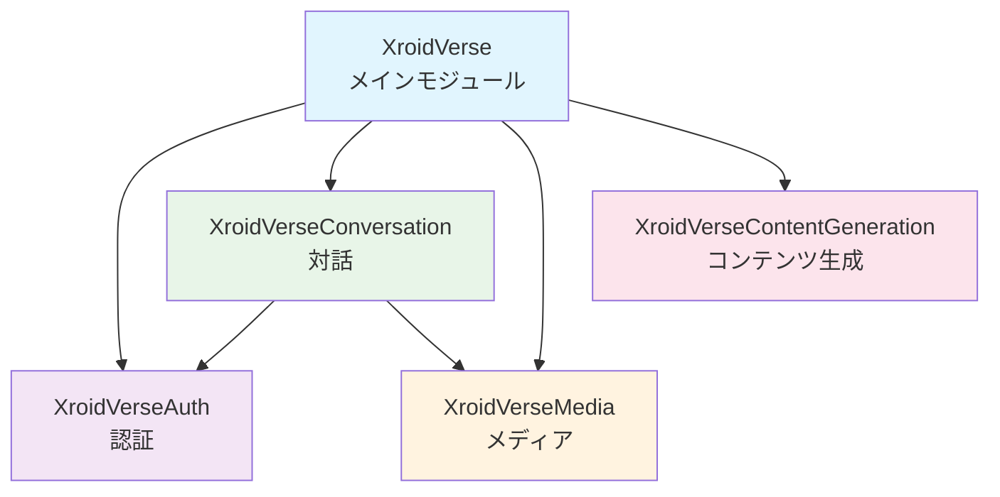

# Sourceアーキテクチャガイド

このドキュメントでは、XroidVerseプロジェクトのSourceフォルダ内の構造と、各モジュール・ファイルの役割について説明します。

:::tip 設計思想
XroidVerseは**モジュラーアーキテクチャ**を採用しており、機能別に独立したモジュールに分割されています。これにより、各機能の独立性と再利用性を確保しています。
:::

## 🏗️ 全体アーキテクチャ

```
Source/
├── XroidVerse/                    # メインモジュール（エントリーポイント、統合）
├── XroidVerseAuth/                # 認証機能モジュール
├── XroidVerseConversation/        # 対話・AI機能モジュール
├── XroidVerseContentGeneration/   # コンテンツ生成機能モジュール
├── XroidVerseMedia/               # メディア処理機能モジュール
├── XroidVerse.Target.cs           # ゲームビルド設定
└── XroidVerseEditor.Target.cs     # エディタビルド設定
```

## 📁 各モジュール詳細

import Tabs from '@theme/Tabs';
import TabItem from '@theme/TabItem';

<Tabs>
<TabItem value="main" label="XroidVerse（メイン）" default>

### XroidVerse（メインモジュール）
**役割**: プロジェクト全体の統合・エントリーポイント

```
XroidVerse/
├── Application/
│   └── GameModes/                 # ゲームモード関連
├── XroidVerse.Build.cs           # モジュール依存関係定義
├── XroidVerse.h                  # モジュールヘッダー
└── XroidVerse.cpp                # モジュール初期化
```

**主な機能**:
- 全モジュールの統合・調整
- プロジェクト全体の依存関係管理
- ゲームモードの基盤提供

**依存モジュール**:
- Core, CoreUObject, Engine（UE5基本）
- Json, JsonUtilities, HTTP（データ通信）
- UMG, Slate, SlateCore（UI）
- **すべての機能モジュール**（Auth, Conversation, Media, ContentGeneration）

</TabItem>
<TabItem value="auth" label="認証モジュール">

### XroidVerseAuth（認証モジュール）
**役割**: ユーザー認証・セッション管理

```
XroidVerseAuth/
├── UI/
│   ├── AuthHUD.h/.cpp            # 認証用HUD
│   └── FirebaseAuthWidget.h/.cpp # Firebase認証ウィジェット
├── Infrastructure/
│   ├── FirebaseAuthSubsystem.h/.cpp     # Firebase認証サブシステム
│   └── SessionManagerSubsystem.h/.cpp   # セッション管理サブシステム
├── XroidVerseAuth.Build.cs       # モジュール設定
├── XroidVerseAuth.h              # モジュールヘッダー
└── XroidVerseAuth.cpp            # モジュール初期化
```

**主な機能**:
- Firebase Authentication統合
- ユーザーログイン・ログアウト
- セッション状態管理
- 認証UI提供

**技術スタック**:
- Firebase Authentication
- UMG (UI)
- Subsystem Architecture

</TabItem>
<TabItem value="conversation" label="対話モジュール">

### XroidVerseConversation（対話モジュール）
**役割**: AI対話・チャット機能

```
XroidVerseConversation/
├── UI/
│   ├── UserInputWidget.h/.cpp    # ユーザー入力ウィジェット
│   └── UserSelectWidget.h/.cpp   # ユーザー選択ウィジェット
├── Infrastructure/
│   ├── AIChatSubsystem.h/.cpp           # AI チャットサブシステム
│   └── CodeblockMonitorSubsystem.h/.cpp # コードブロック監視サブシステム
├── Application/
│   └── GameModes/                 # 対話用ゲームモード（予定）
├── XroidVerseConversation.Build.cs # モジュール設定
├── XroidVerseConversation.h       # モジュールヘッダー
└── XroidVerseConversation.cpp     # モジュール初期化
```

**主な機能**:
- AI との対話システム
- チャット UI の提供
- コードブロック処理・監視
- ユーザー入力の処理

**依存関係**:
- XroidVerseAuth（認証情報取得）
- XroidVerseMedia（音声入力）
- FirebaseGoodies（データ同期）

</TabItem>
<TabItem value="content" label="コンテンツ生成">

### XroidVerseContentGeneration（コンテンツ生成モジュール）
**役割**: AI生成コンテンツの処理・管理

```
XroidVerseContentGeneration/
├── Core/
│   └── JsonScheduleActor.h/.cpp  # JSON形式のスケジュール処理アクター
├── Utils/
│   └── ScheduleJsonDecoder.h/.cpp # JSONデコード・パースユーティリティ
├── XroidVerseContentGeneration.Build.cs # モジュール設定
├── XroidVerseContentGeneration.h # モジュールヘッダー
└── XroidVerseContentGeneration.cpp # モジュール初期化
```

**主な機能**:
- AI生成コンテンツの解析・処理
- JSONデータのパース・変換
- スケジュール関連データの管理
- コンテンツ構造化

**技術要素**:
- JSON処理
- データ構造化
- Actor-based処理

</TabItem>
<TabItem value="media" label="メディア処理">

### XroidVerseMedia（メディア処理モジュール）
**役割**: 音声・映像処理

```
XroidVerseMedia/
├── Infrastructure/
│   ├── SpeechRecognizerSubsystem.h/.cpp    # 音声認識サブシステム
│   └── RecordingSettingsSubsystem.h/.cpp   # 録画設定サブシステム
├── XroidVerseMedia.Build.cs       # モジュール設定
├── XroidVerseMedia.h              # モジュールヘッダー
└── XroidVerseMedia.cpp            # モジュール初期化
```

**主な機能**:
- 音声認識・音声入力処理
- 録画・録音機能
- メディア設定管理
- リアルタイム音声処理

**技術スタック**:
- UE5 Audio System
- 音声認識API統合
- レコーディング機能

</TabItem>
</Tabs>

---

## 🔧 ビルド設定ファイル

| ファイル | 役割 | タイプ | 含まれるモジュール |
|----------|------|--------|-------------------|
| **XroidVerse.Target.cs** | ゲーム用ビルドターゲット設定 | TargetType.Game | XroidVerse（メインのみ） |
| **XroidVerseEditor.Target.cs** | エディタ用ビルドターゲット設定 | TargetType.Editor | XroidVerse（メインのみ） |

## 🏛️ アーキテクチャパターン

### 1. レイヤードアーキテクチャ
各モジュール内で以下の構造を採用：

```
Application/     # アプリケーションロジック（GameModes等）
UI/             # ユーザーインターフェース
Infrastructure/ # インフラストラクチャ（Subsystems等）
Core/           # コア機能
Utils/          # ユーティリティ
```

### 2. サブシステム

:::info サブシステム一覧
以下のサブシステムがプロジェクト全体で利用可能です：

| サブシステム | 機能 | モジュール |
|-------------|------|-----------|
| **AIChatSubsystem** | AI対話の管理 | XroidVerseConversation |
| **FirebaseAuthSubsystem** | Firebase認証 | XroidVerseAuth |
| **SessionManagerSubsystem** | セッション管理 | XroidVerseAuth |
| **SpeechRecognizerSubsystem** | 音声認識 | XroidVerseMedia |
| **CodeblockMonitorSubsystem** | コードブロック監視 | XroidVerseConversation |
| **RecordingSettingsSubsystem** | 録画設定 | XroidVerseMedia |
:::

### 3. モジュール間依存関係



## 🚀 開発ガイドライン

### 1. 新機能追加時

:::info 📋 チェックリスト
- ✅ 適切なモジュールを選択（または新モジュール作成）
- ✅ レイヤードアーキテクチャに従ってファイル配置
- ✅ 依存関係は`Build.cs`で明示的に定義
- ✅ サブシステムを活用してグローバル状態管理
:::

### 2. モジュール設計原則

| 原則 | 説明 | 実装方法 |
|------|------|----------|
| **単一責任** | 各モジュールは明確な責任を持つ | 機能別にモジュール分割 |
| **疎結合** | モジュール間の依存は最小限に | インターフェース経由での通信 |
| **高凝集** | 関連機能は同一モジュール内に配置 | 機能単位でのファイル整理 |
| **依存性注入** | サブシステム経由でサービス提供 | UE5のSubsystem活用 |

### 3. 命名規則

:::tip 命名規則
- **クラス**: UE5標準に従う（A, U, F プレフィックス）
- **ファイル**: 機能を明確に表す名前
- **モジュール**: `XroidVerse[機能名]` 形式
:::

## 📝 注意事項

:::warning 重要な注意点
1. **ビルド順序**: 依存関係の循環を避ける
2. **パフォーマンス**: サブシステムの初期化順序に注意
3. **プラットフォーム**: Windows対応を意識
:::

---

:::note 更新情報
このドキュメントは開発の進行に合わせて更新されます。最新の情報については、GitHubリポジトリをご確認ください。
::: 